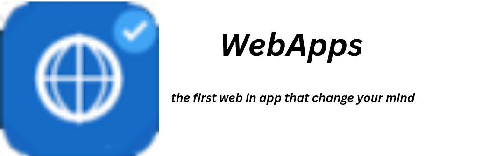

## WebApps

---

<p align="center">
    
</p>
<p align="center"><sub>Cara paling aman dan terbaik untuk menikmati aplikasi web.</sub></p>
<div align="center">
  <p>
    <a href="LICENSE"></a>
    <a href="https://github.com/hastagaming/webapps/releases"></a>
    
    
    
  </p>
</div>


| SAYA INGIN... | MENU TUJUAN |
|---|---|
| Fitur WebApps | [LIHAT FITUR](#fitur) |
| Teknologi WebApps | [LIHAT TEKNOLOGI](#teknologi-dan-pustaka) |
| Persyaratan Sistem | [LIHAT PERSYARATAN](#persyaratan-sistem) |
| Struktur Proyek | [LIHAT STRUKTUR](#struktur-proyek) |
| Keamanan WebApps | [LIHAT KEAMANAN](#catatan-keamanan) |

Peramban web *multi-container* yang siap pakai untuk Android. WebApps memungkinkan Anda menjalankan beberapa sesi web independen secara berdampingan. Setiap sesi memiliki kuki (*cookies*), penyimpanan, izin, dan siklus hidupnya sendiri — diatur ke dalam kelompok (*groups*), dilindungi dengan kunci PIN, dan tetap aktif di latar belakang melalui layanan latar depan (*foreground service*) khusus.

## Fitur

- **Multi Kontainer** — Menjalankan banyak sesi web terisolasi secara bersamaan, masing-masing dengan kuki dan penyimpanan lokal yang independen.
- **Multi Kelompok** — Mengatur kontainer ke dalam kelompok berbasis warna untuk navigasi yang lebih mudah.
- **Mode Layar Penuh** — Menyembunyikan bilah aplikasi (*app bar*) untuk pengalaman berselancar yang imersif seperti aplikasi asli.
- **Tetap Aktif (Keep Alive)** — Mengizinkan kontainer pilihan untuk tetap berjalan di latar belakang bahkan saat tidak terlihat di layar.
- **Sesi Persisten** — Kuki dan data situs tetap tersimpan meskipun aplikasi dimulai ulang.
- **Mode Desktop** — Mengubah *user agent* kontainer menjadi versi peramban desktop kapan saja dibutuhkan.
- **Mode Orientasi** — Mengunci kontainer ke mode tegak (*portrait*), mendatar (*landscape*), atau mengikuti pengaturan sistem.
- **Pengalih Aplikasi Usap ke Atas** — Usap ke atas dari bagian bawah layar peramban untuk melihat dan mengelola semua kontainer yang aktif, mirip dengan fitur pengalih tugas (*task switcher*) di ponsel.
- **Deteksi Favicon** — Kontainer secara otomatis menampilkan ikon (*favicon*) dari situs web yang dituju.
- **Validasi URL & Deteksi Tipografi** — Mendeteksi kesalahan ketik pada domain umum (misal: `gogle.com` → `google.com`) sebelum memuat halaman.
- **Penerapan HTTPS & Opsi HTTP** — Koneksi HTTP diblokir secara default, dengan dialog persetujuan sekali klik untuk melewatinya.
- **Perlindungan Situs Berbahaya** — Memblokir domain berbahaya yang telah diketahui dan mendeteksi serangan homograf yang mencurigakan.
- **Pengelola Izin** — Kontrol akses per kontainer untuk Kamera, Mikrofon, Lokasi, Notifikasi, dan Penyimpanan (Selalu Izinkan / Selalu Tolak / Tanya Setiap Saat).
- **Kunci Kontainer** — Melindungi kontainer apa pun dengan PIN yang disimpan sebagai *hash* SHA-256.
- **Pemeriksa Sumber Kode (Source Inspector)** — Melihat kode sumber halaman (HTML) secara langsung dan memantau log permintaan sumber daya jaringan yang sedang berjalan.
- **Mode Pemulihan** — Mendeteksi siklus kegagalan (*crash loops*), pemuatan halaman yang macet, serta kegagalan *renderer* secara otomatis, lalu menawarkan opsi *Soft Reset* (muat ulang) atau *Hard Reset* (bersihkan cache dan kuki).
- **Dukungan Unduhan** — Menangkap permintaan unduhan dari kontainer mana pun dan melacak proses unduhannya.
- **Cadangkan & Pulihkan** — Mengekspor semua kelompok dan kontainer ke file portabel yang dapat dienkripsi dengan Android Keystore (AES-256-GCM), menggunakan strategi pemulihan Gabungkan (*Merge*) atau Ganti Semua (*Replace All*).
- **Layanan Latar Depan (Foreground Service)** — Menjaga kontainer aktif tetap berjalan dengan notifikasi persisten yang mendukung tindakan Buka, Segarkan, Hentikan, Segarkan Semua, dan Hentikan Semua.

## Teknologi dan Pustaka

- **Bahasa:** Kotlin
- **UI:** Jetpack Compose, Material 3
- **Arsitektur:** MVVM (ViewModel + StateFlow, pola Event/State satu arah)
- **Dependency Injection:** Hilt
- **Penyimpanan Data:** Room (SQLite)
- **Serialisasi:** kotlinx.serialization
- **Keamanan:** Android Keystore, EncryptedSharedPreferences
- **Navigasi:** Navigation Compose
- **SDK Minimal:** 26 (Android 8.0 Oreo)
- **Target SDK:** 35 (Android 15)

## Persyaratan Sistem

- Perangkat Android atau emulator yang menjalankan Android 8.0 (API 26) atau versi yang lebih tinggi.

## Struktur Proyek
```code
app/src/main/java/com/web/apps/
├── WebAppsApplication.kt
├── MainActivity.kt
├── core/
│   ├── container/        # Manajemen siklus hidup sesi multi-kontainer
│   ├── inspector/        # Pemeriksa Sumber (kode sumber halaman + log jaringan)
│   ├── permission/       # Pengaturan izin akses per kontainer
│   ├── recovery/         # Deteksi dan pemulihan crash loop / waktu habis
│   ├── security/         # Keystore, preferensi terenkripsi, penjelajahan aman
│   └── webview/          # WebView client, chrome client, dan factory
├── backup/                # Model ekspor/impor cadangan dan serialisasi
├── data/
│   ├── local/             # Entitas Room, DAO, basis data, konverter
│   └── repository/        # Repositori dan validasi URL
├── di/                    # Modul Hilt
├── service/               # Layanan latar depan (foreground service) dan pengontrolnya
└── ui/
    ├── appswitcher/        # Tampilan hamparan Pengalih Aplikasi Usap ke Atas
    ├── backup/             # Layar Cadangkan & Pulihkan
    ├── browser/            # Layar utama peramban dan ViewModel
    ├── containerlist/      # Daftar kontainer dan kisi multi-kelompok
    ├── containerlock/      # UI pembuatan kunci PIN dan buka kunci
    ├── inspector/          # Layar Pemeriksa Sumber Kode
    ├── navigation/         # NavHost dan tujuan navigasi
    ├── permission/         # Layar Pengelola Izin
    ├── recovery/           # Dialog Pemulihan dan ViewModel
    └── theme/              # Tema Material 3
```

## Catatan Keamanan
- Semua PIN diubah menjadi *hash* dengan SHA-256 sebelum disimpan; PIN asli dalam bentuk teks biasa tidak pernah disimpan di penyimpanan.
- Cadangan data yang terenkripsi menggunakan kunci AES-256-GCM yang dibuat dan disimpan di dalam Android Keystore. Dengan demikian, kunci enkripsi tidak pernah keluar dari penyimpanan berbasis perangkat keras yang aman (*hardware-backed storage*).
- Fitur Perlindungan Situs Berbahaya berfungsi memblokir domain berbahaya yang telah diketahui serta mendeteksi karakter homograf non-Latin yang mencurigakan pada nama host.